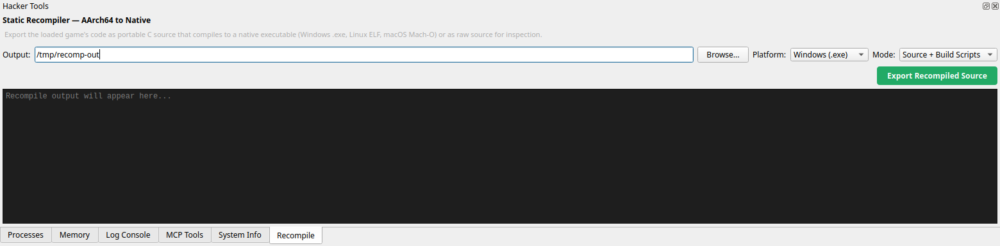
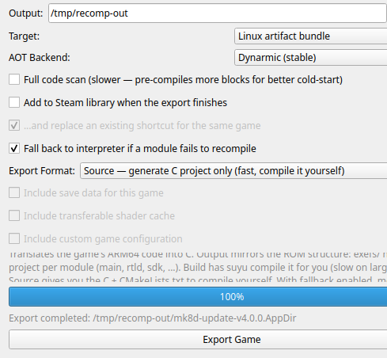

# mk8-recomp

Static recompilation of Nintendo Switch AArch64 CPU code to native x86-64, using
[suyu v0.0.4](https://github.com/suyu-emu/suyu-v0.0.4)'s AOT recompiler as the
starting point and its HLE stack for everything above the CPU.

**The recompiled image now runs without a JIT behind it.** A full recorded input
replay executes entirely from statically recompiled C, reaching the dynamic
recompiler once — for one address — across the whole run.

The emitter is **AArch64-only** and the pipeline is target-agnostic: which title
is exported comes from `MK8R_TARGET`, and nothing is hardcoded to one. Check a
new target's `is64` flag before spending an export on it — see
[`docs/aarch32.md`](docs/aarch32.md).



## Performance

Fixed work, not frames per second at equal wall-clock: a recorded 10,692-frame
input sequence is replayed at unlimited speed and timed to completion, so both
engines execute the same guest work and the only variable is how fast they do
it. Linux, Ryzen 9 5900X, GCC, four reps with the three arms interleaved inside
each rep.

| engine | reps (ms/frame) | mean | vs dynarmic |
|---|---|---|---|
| dynarmic (JIT only) | 2.800 2.842 2.812 2.793 | 2.812 | 1.00x |
| hybrid (static + JIT) | 1.679 1.642 1.618 1.659 | **1.650** | **1.70x** |
| JIT-free (static only) | 1.847 1.837 1.787 1.794 | **1.816** | **1.55x** |

The distributions do not overlap. Every rep waits for the machine to go idle
first and records the load average it ran under; a round taken under load is
discarded rather than averaged in.

The hybrid image is faster than the JIT-free one because two instruction
families are deliberately left untranslated there: the JIT compiles those
particular blocks better than the emitter does, and paying a transition to stay
on it is cheaper than owning them. A JIT-free image has no such option, so it
translates them and accepts the cost. Closing that 10% is the current work.

### How it got there

Each step measured the same way, interleaved against the build before it:

| change | effect on the JIT-free build |
|---|---|
| per-thread executed-block counter | 10.7% |
| resolve indirect branch targets inside the image | 7.6% |
| resolve branch conditions and flag updates at translation time | 6.4% |
| pair helpers for `LDP`/`STP` and 128-bit access | ~3% |

Measured and rejected: `-O2` on the generated modules, `-fno-stack-protector`, a
branchless fixed-point conversion, and raising the block-chaining budget from 32
to 256 with real tail calls. None of them moved the benchmark.

## Correctness

There is no substitute for running the thing, but running it is not evidence on
its own, so each piece is checked against something independent of the emitter.

| what | how it is checked | result |
|---|---|---|
| instruction decode | 224 cases, every encoding assembled by `aarch64-linux-gnu-as` and confirmed with `objdump` before use | 224/224 |
| decoder masks | negative cases pin each mask, so a mask that grew too wide and swallowed a neighbouring encoding fails the suite | included above |
| condition codes | all 16 codes x all 16 flag states against the reference implementation | 0 mismatches |
| NZCV | 8,000,324 add and subtract cases, both widths, edges and random | 0 mismatches |
| SHA-1 | a real padded block driven through all six instructions, compared to the published digest of `"abc"` | matches |
| SHA-256 | same, through the schedule and round instructions | matches |
| AES | generated S-box against FIPS-197, and a round trip | matches |
| saturating fixed-point conversion | 16.7M float values plus every boundary, against the form it replaced | 0 mismatches |
| dispatch coverage | every address the dispatcher could not resolve is recorded and fed back as a discovery root | 0 misses |
| decode coverage | fraction of decoded instructions with no translation | 0.002%, all of them non-instructions |

The crypto families needed the end-to-end check because there is no software
reference to compare against: the JIT implements them with the host's own
hardware instructions and asserts on the CPU feature, so reading its source
proves nothing about a C implementation.

"All of them non-instructions" means what is left is module header bytes that
block discovery walks as though they were code. There is nothing to translate
there, and nothing executes them.

**What this is not.** There is no differential harness running both engines and
stopping at the first divergence in guest register state. Until there is, the
correctness claim is "a long recorded replay produces the same frame count and
the same visible result", which is strong evidence and not proof. That harness
is the next item on the roadmap.

## Doing a JIT-free build

The steps below assume a working checkout and your own legally dumped title.
Paths come from the environment: `MK8R_ROOT`, `MK8R_TARGET`, `MK8R_PACKAGE`,
`MK8R_ROM` (what you boot) and `MK8R_EXPORT_ROM` (what you export from).

Those last two are not the same thing and the difference matters. A cartridge
can carry a base program built for a different architecture than the update that
actually runs, in which case exporting from the boot image silently produces the
wrong module set.

**1. Translate everything.** Two instruction families are off by default because
they lose to the JIT. A JIT-free image has nothing to lose to, so turn them on:

```bash
export SUYU_AOT_TRANSLATE_ALL=1
```

**2. Export, then build every module.**

```bash
./scripts/reexport-rebuild.sh
```

This rebuilds the emulator, clears the previous export, runs a fresh one, and
compiles each generated module. It refuses to report success if any built image
is older than the emitter — every measurement this project has had to throw away
was a build that silently did not happen.

**3. Find what block discovery could not reach.** Discovery follows branches it
can see, so a block only ever reached through a computed target is invisible to
it and never gets emitted. Run once with the dispatcher recording every address
it could not cover:

```bash
SUYU_RECOMP_RECORD_MISSES=$MK8R_ROOT/local/roots ./scripts/run-hybrid.sh --tas --unlimited
```

**4. Feed them back and re-export.**

```bash
SUYU_AOT_EXTRA_ROOTS=$MK8R_ROOT/local/roots ./scripts/reexport-rebuild.sh
```

Repeat 3 and 4 until a run records nothing new. A newly reachable block can
expose further ones; in our case it converged on the fourth round.

**5. Run it.**

```bash
SUYU_RECOMP_DIR=$MK8R_ROOT/build/recomp/$MK8R_TARGET ./scripts/run-hybrid.sh --tas --unlimited
```

The coverage report written to `~/.local/share/suyu/log/recomp_coverage.txt`
says whether it worked. `static -> JIT` is the number that matters; a JIT-free
image reports 0 lookup misses and 0 unimplemented opcodes.

### Knobs

| variable | what it does |
|---|---|
| `SUYU_AOT_TRANSLATE_ALL` | translate the families that are off by default |
| `SUYU_AOT_EXTRA_ROOTS` | directory of recorded addresses to seed block discovery |
| `SUYU_RECOMP_RECORD_MISSES` | directory to record addresses the dispatcher could not cover |
| `SUYU_RECOMP_DIR` | directory of built module images to load |
| `SUYU_RECOMP_CHAIN_BUDGET` | blocks a chain may run before returning to the dispatcher |
| `RECOMP_OPT_FLAGS` | optimisation flags for the generated block bodies |

The export can also be driven from the emulator directly:



## Roadmap

- [x] **Decode.** Translate the instruction set the title actually uses. Done:
      the only gaps left are non-instructions.
- [x] **Dispatch.** Reach every block that executes, including those only
      reachable through computed targets. Done: 0 lookup misses, via recorded
      roots fed back into discovery.
- [x] **Run without a JIT.** Done: one transition across a full replay.
- [x] **Beat the JIT.** Done: 1.70x hybrid, 1.55x JIT-free.
- [ ] **Prove it, rather than demonstrate it.** A differential harness running
      both engines in lockstep and stopping at the first divergence in guest
      state. This is the gap between "runs correctly as far as anyone can see"
      and "is correct".
- [ ] **Close the JIT-free gap.** 1.55x against the hybrid build's 1.70x. The
      remaining cost is guest memory access and the dispatcher, not the
      translated arithmetic — individual generated blocks are each under 0.3% of
      run time.
- [ ] **One binary.** Link the runtime into the generated image so a recompiled
      title runs without an emulator process around it.
- [ ] **A second title.** The pipeline takes its target from the environment and
      hardcodes nothing, but that has only been exercised against one.
- [ ] **AArch32.** Not planned. It would mean a second decoder and a second
      translation strategy, not an extension of this one.

## What this repository contains

Our own code, build tooling and documentation. It contains no game data, no
Nintendo code, no keys, no firmware, and no generated C — that material is
produced locally and gitignored. The screenshots above are of our own tooling;
no frame of any game appears in this repository.

You need your own legally dumped game and your own keys. This project will not
help you obtain either, and will not answer requests to.

The rules the project holds itself to, including why recompiler output is never
published, are in [`LEGAL.md`](LEGAL.md). Working assumptions and their
confidence levels are in [`docs/assumptions.md`](docs/assumptions.md).

## Layout

```
docs/         architecture, assumptions, emulator findings
scripts/      reproducible PowerShell/Python for every step
tests/        decoder tests and differential validation
third_party/  suyu submodule, pinned to a commit on our fork
```

## Building

One command per platform, from nothing to built. Each installs the toolchain,
clones with submodules and builds. Neither fetches a game, keys, or firmware.

**Linux** — any distro with `apt`, `dnf`/`yum`, `pacman`, `zypper`, `apk`,
`xbps` or `eopkg`. Package names are per-distro; unknown ones are reported and
skipped rather than aborting the install:

```bash
curl -fsSL https://raw.githubusercontent.com/dougchansan/mk8-recomp/main/scripts/setup-linux.sh | bash
```

The script is bash, and Alpine and Void do not ship bash — install it first there
(`apk add bash`, `xbps-install -y bash`). Every other distro tested has it.

**Windows** — an Administrator PowerShell, because the MSVC C++ toolset needs
one. Everything comes from `winget`; an existing Visual Studio with the C++
workload is reused rather than duplicated:

```powershell
irm https://raw.githubusercontent.com/dougchansan/mk8-recomp/main/scripts/setup-windows.ps1 | iex
```

Both clone into `./mk8-recomp` (`MK8R_ROOT` overrides), or build in place if
you run them from inside a clone you already have. To stop partway:
`--deps-only` / `--no-build` on Linux, `$env:MK8R_SETUP='deps'` or `'nobuild'`
on Windows. `./scripts/setup-linux.sh --dry-run` lists the packages it would
install without touching the system.

<details>
<summary>Doing it by hand</summary>

The setup scripts are a wrapper around three steps. Clone with submodules, then
on Linux install Qt 6, GCC, nasm, glslang and the codec/Boost development
packages and run the build script — it needs CMake 3.31 or newer, and tells you
where to put one if yours is older:

```bash
git clone --recursive https://github.com/dougchansan/mk8-recomp && cd mk8-recomp && ./scripts/build-suyu.sh
```

On Windows, `bootstrap.ps1` downloads the pinned glslang and Qt into
`local/tools`. It verifies a dump when `MK8R_ROM` points at one and skips that
step with `-SkipGame`:

```powershell
git clone --recursive https://github.com/dougchansan/mk8-recomp; cd mk8-recomp; .\scripts\bootstrap.ps1 -SkipGame; .\scripts\build-suyu.ps1
```

Both build scripts take `--clean` / `-Clean` to start from scratch and
`--configure` / `-Configure` to force a reconfigure. If you cloned without
`--recursive`, run `git submodule update --init --recursive` first; the scripts
stop with that instruction rather than failing inside cmake.

</details>

Building one generated module into a loadable image, once you have exported
locally:

```bash
./scripts/build-recomp.sh main       # Windows: .\scripts\build-recomp.ps1 -Module main
```

## Start here

1. [`docs/suyu-recompiler-findings.md`](docs/suyu-recompiler-findings.md) — what
   suyu v0.0.4's recompiler actually is, verified against source rather than
   against its release notes. Read this before anything else.
2. [`docs/bootstrap.md`](docs/bootstrap.md) — machine and toolchain verification
   for this workspace.
3. [`docs/architecture.md`](docs/architecture.md) — the pipeline as it exists and
   where we intend to extend it.
4. [`docs/aarch32.md`](docs/aarch32.md) — the one hard limit on what can be
   targeted, and how to check a title before spending an export on it.

## The emulator

`third_party/suyu` is a submodule of [`dougchansan/suyu-v0.0.4`][fork], pinned to
an exact commit.

suyu was archived upstream, so this is a continuation rather than a temporary
divergence: the name and numbering carry on, `0.0.4` becomes `0.0.5`. The base
is `suyu-emu/suyu-v0.0.4` at `d1d09321d7ab84252291e05b3efbc8a8dfa57481`,
GPL-3.0-or-later. See [`PROVENANCE.md`][prov] in the fork for the base, the
licensing, and the significant changes.

The change set is:

```
git -C third_party/suyu diff d1d09321d7ab84252291e05b3efbc8a8dfa57481..main
```

Several of those commits fix defects in suyu itself and are not
recompiler-specific — most notably that no installed update or DLC was ever
indexed in NAND, for any title.

`externals/dynarmic` inside that fork points at
[`dougchansan/dynarmic`][dyn] for the same reason: upstream committed a
forwarding header containing an absolute path into a developer's home directory,
so it built on one machine. That repository is *not* archived, so unlike the
suyu changes it could reasonably go upstream as a PR.

[dyn]: https://github.com/dougchansan/dynarmic/tree/mk8-recomp
[fork]: https://github.com/dougchansan/suyu-v0.0.4
[prov]: https://github.com/dougchansan/suyu-v0.0.4/blob/main/PROVENANCE.md

## Licence

GPL-3.0-or-later, matching upstream.
